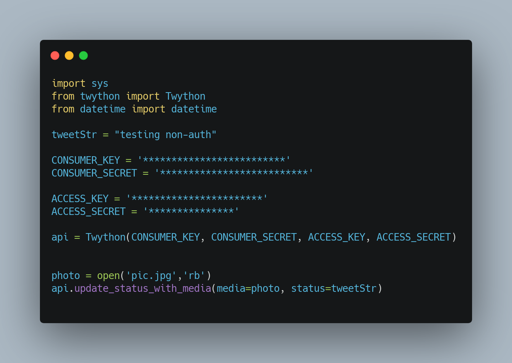
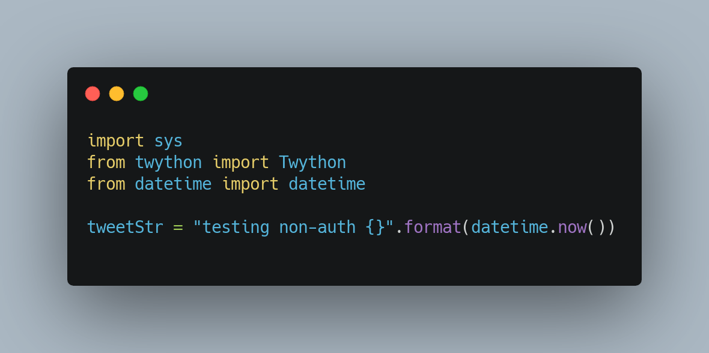
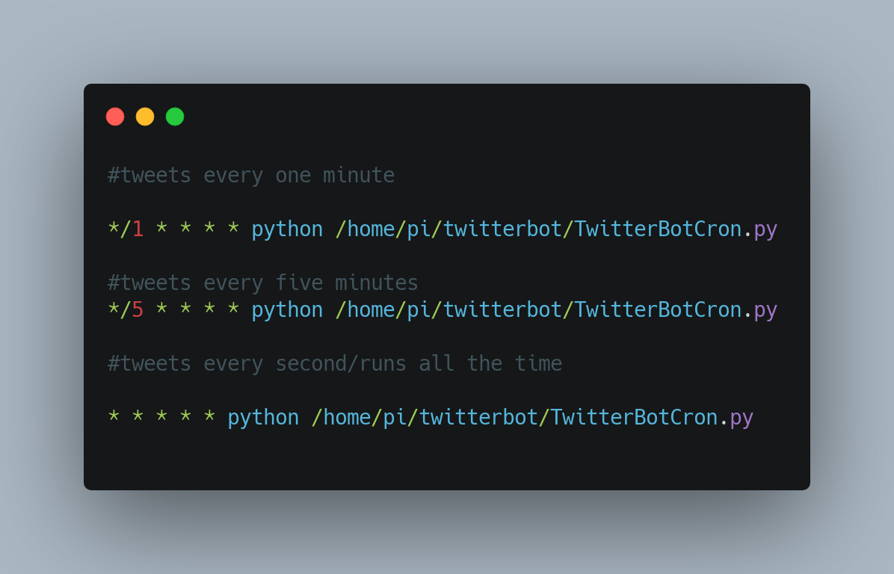

# Twitter Bot
I am working on a raspberry pi twitter bot.

| **Engineer** | **School** | **Area of Interest** | **Grade** |
|:--:|:--:|:--:|:--:|
| Vickie Chen | Monta Vista High School | Artificial Intelligence | Incoming Senior

  
# Final Milestone
coming soon

# Second Milestone

My second milestone consisted of fixing some of the code I wrote before and tweeting out images. I was also able to automate the Twitter bot and post tweets  with specific time intervals or different times of the day. I had to fix some of my previous code because in order to automate the Twitter bot, I can't manually authorize the app every single time I post a tweet. To tweet out photos and videos, I used the same function as tweeting out plain text posts, but added '_with_media' and defined the media (<i>photo</i> in my code). 

For automating the Twitter bot, I used cron job commands. I imported datetime in my code and to print out the timestamp of the times the tweets posted to keep track. I tested out multiple time intervals, like one minute, five minutes, and even having it run all the time. 

| importing datetime | crontab file| 
|    :----:      |    :----:   | 
| |  |

| **One minute** | **Five minutes** | **Every minute** | 
|:---        |    :----:   |          ---: |
|  |  | |

# First Milestone
  

My first milestone was setting up and connecting the Raspberry Pi with my computer with VNC Viewer for more effecient coding. I downlaoded Raspberry Pi OS (Mac version to be compatible with my laptop) on my SD card and uploaded to a LCD monitor. I connected my keyboard and mouse wirelessly to the monitor, then downloaded VNC Viewer on my MacBook. Using VNC Viewer, I casted my monitor to my Mac so that it would show on my Mac everything that was happening on the monitor. All my coding is done on my Mac since it's much easier. I had to make a Twitter Developer App account to link my code to my the Twitter account I was posting on. I created my Twitter bot using Python and importing Twython to use the packages it came with. I had to generate API and authorization keys from my Twittter developer account and set those to constants in my code. Another part of my first milestone was being able to finally send out a tweet on my account using Raspberry Pi. There was a 401 authorization error that took me a few days to fix, and I found code that worked to authorize the app manually with a link everytime I ran the command line to post a tweet. 

