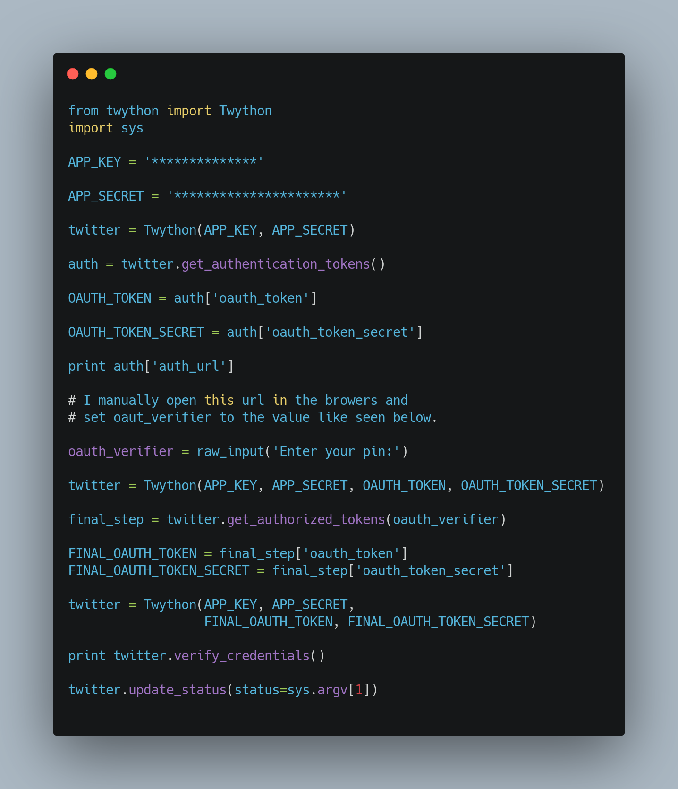

# Twitter Bot
I am working on a raspberry pi twitter bot.

| **Engineer** | **School** | **Area of Interest** | **Grade** |
|:--:|:--:|:--:|:--:|
| Vickie Chen | Monta Vista High School | Artificial Intelligence | Incoming Senior

  
# Final Milestone
My final milestone is the increased reliability and accuracy of my robot. I ameliorated the sagging and fixed the reliability of the finger. As discussed in my second milestone, the arm sags because of weight. I put in a block of wood at the base to hold up the upper arm; this has reverberating positive effects throughout the arm. I also realized that the forearm was getting disconnected from the elbow servo’s horn because of the weight stress on the joint. Now, I make sure to constantly tighten the screws at that joint. 

{:target="_blank" rel="noopener"}

# Second Milestone
My final milestone is the increased reliability and accuracy of my robot. I ameliorated the sagging and fixed the reliability of the finger. As discussed in my second milestone, the arm sags because of weight. I put in a block of wood at the base to hold up the upper arm; this has reverberating positive effects throughout the arm. I also realized that the forearm was getting disconnected from the elbow servo’s horn because of the weight stress on the joint. Now, I make sure to constantly tighten the screws at that joint.

{:target="_blank" rel="noopener"}
# First Milestone
  

My first milestone was setting up and connecting the Raspberry Pi with my computer with VNC Viewer for more effecient coding. I used Raspberry Pi Imager and downloaded the MAC OS on my SD card and uploaded to a LCD monitor. I connected my keyboard and mouse wirelessly to the monitor, then downloaded VNC Viewer on my MacBook. Using VNC Viwer, I casted my monitor to my Mac so that it would show on my Mac everything that was happening on the monitor. All my coding is done on my Mac since it's much easier (the keyboard connects too). I had to make a Twitter Developer App account to link everything I was doing on Pi to the actual Twitter account I was using. I created my Twitter bot using Python and importing Twython to use the packages it came with. I had to generate API and authorization keys from my Twittter developer account and set those to constants in my code. Another part of my first milestone was being able to finally send out a tweet on my account using Raspberry Pi. There was a 401 autorization error that took me a few days to fix, and I found code that worked to authorize the app manually with a link everytime I ran the command line to post a tweet. 

